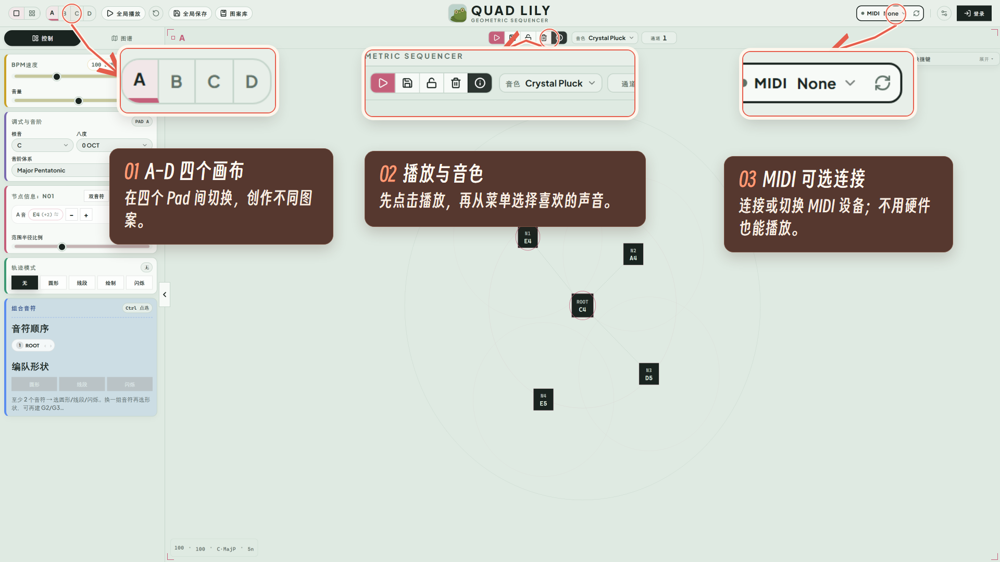
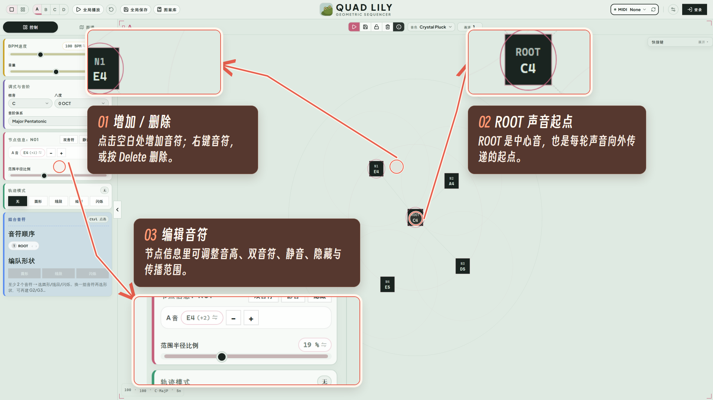
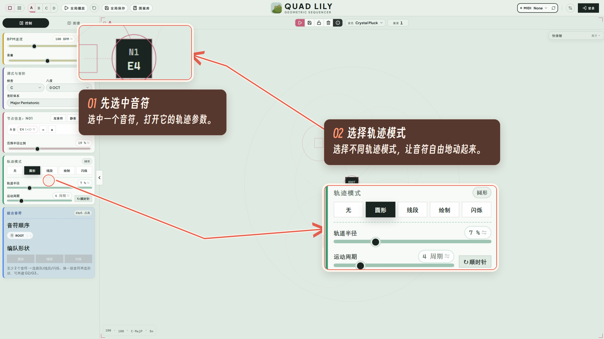
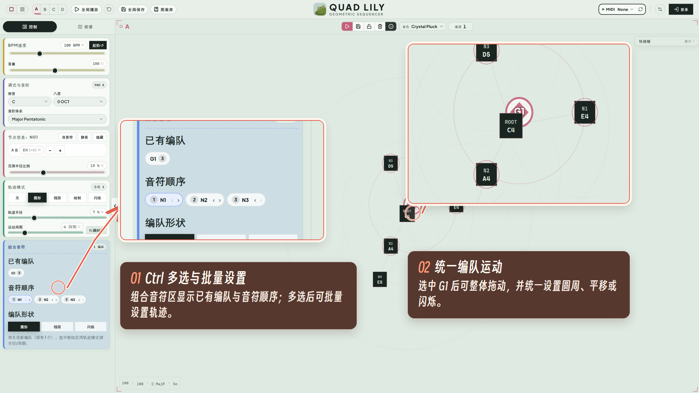
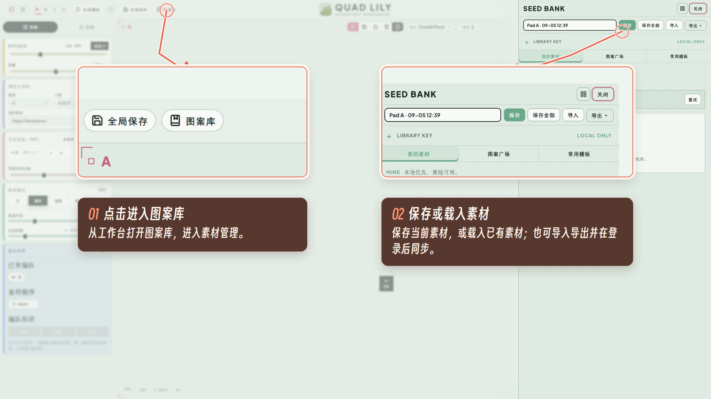

# 音乐画布 · MusiCanvas

音乐画布（MusiCanvas）是一款空间音乐创作工具。它把传统时间轴上的音符带进二维画布：音符可以彼此传递声音，也可以沿圆周、线段或手绘轨迹运动，让编曲变成一场可以观看、触碰和演奏的空间实验。

**[打开在线版本](https://musicanvas.art/desk?onboarding=1)**

## 五步开始创作

### 01 · 四个画布、音色选择与 MIDI 接口

在 A–D 四个 Pad 间切换，选择音色并开始播放。无需硬件即可直接创作，也可以连接 MIDI 设备扩展演奏方式。



### 02 · 随意增删音符，并自定义音符细节

点击画布空白处增加音符，选中音符后调整音高、双音符、静音、隐藏与传播范围。ROOT 是每轮声音向外传递的起点。



### 03 · 选择不同轨迹模式，让音符自由地动起来

为音符选择圆周、线段、绘制或闪烁等轨迹模式，并继续调整运动范围、周期和方向，为声音加入更丰富的律动。



### 04 · 不同音符可批量组合，并设置统一运动轨迹

按住 Ctrl 多选音符，把它们组成编队并批量设置轨迹。编队可以统一进行圆周或平移等运动，也可以通过组控制点整体调整。



### 05 · 进入图案库，保存素材或载入已有素材

把当前 Pad 或完整四 Pad 场景保存到图案库，也可以载入已有素材、导入导出作品，并通过个人账号在不同设备间同步。



## 核心体验

- **空间化编曲**：在二维画布上组织音符，不再受单一时间轴限制。
- **声音传递**：以 ROOT 为起点，让音符按照距离与周期依次发声。
- **运动自动化**：用圆周、线段、手绘和闪烁轨迹塑造动态节奏。
- **编队控制**：组合多个音符，统一设置参数与运动方式。
- **保存与同步**：保存单个 Pad 或完整场景，支持图案库、导入导出与跨设备同步。
- **MIDI 支持**：连接 MIDI 设备，将画布中的创作接入硬件演奏流程。

## 本地运行

需要 Node.js 22.18 或更高版本。

```bash
npm install
npm run dev
```

启动后打开终端显示的本地地址，并进入 `/desk`。

## 测试与构建

```bash
npm test
npx tsc --noEmit
npm run build
```

## 部署与数据

构建产物位于 `dist/`。项目包含 Netlify Functions；账号与云端图案库需要在自己的 Netlify 项目配置 Identity 和 Blobs，单纯运行 Vite 不提供云端服务。本地演奏不需要账号。

源码中的 `quad` 命名与部分历史存储键为兼容现有作品而保留。本仓库独立维护音乐画布，不包含旧仓库的其他项目分支或提交历史。

## 开源许可

项目代码采用 [MIT License](LICENSE)。第三方依赖、字体等仍遵循各自许可证。
