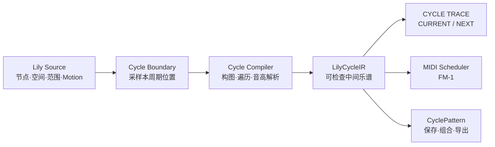

# 空间化音乐交互与 Quad Lily 研究档案

这份档案汇总与 GEMIDI / Quad Lily 相关的产品、软件、艺术作品和动态乐谱案例，并记录项目从 FM-1 MIDI 实验、Pattern 捕获、Desk，到四画布 Quad Lily 与运动自动化的设计演变。

当前核心命题不是把自由画布改造成传统音序器，而是建立一层可读、可预测、可保存的中间语言：

> **自由画布是源语言；Cycle Compiler 将它编译为结构；CYCLE TRACE 让结构可见；同一份 IR 驱动预览与 MIDI。**

## 目录

- [[#1. 阅读说明与资料状态]]
- [[#2. 一页结论]]
- [[#3. 产品、App 与音乐系统]]
- [[#4. 艺术家、作品与表演案例]]
- [[#5. 跨案例的机制地图]]
- [[#6. GEMIDI → Quad Lily 项目沿革]]
- [[#7. 当前系统判断：自由画布、编译器与 IR]]
- [[#8. CYCLE TRACE / 周期译谱]]
- [[#9. 后续需要核验的资料]]
- [[#10. 自由运动音符：玩法研究]]

## 1. 阅读说明与资料状态

本文使用以下标记：

- `已核验`：链接来自艺术家、项目团队、大学、博物馆、作曲家或项目官方文档。
- `待验证`：概念已有可信来源，但当前可用性、版本、原始视频或某项技术细节仍需补充验证。
- `Quad Lily 关系`：不是说案例与本项目完全相同，而是指出可迁移的交互原则。
- `可借鉴点`：记录可转化为设计、规则或实验的部分，不等于直接复制界面。

## 2. 一页结论

### 2.1 这个领域并非无人探索，但 Quad Lily 的组合仍然特殊

已有创作者分别探索过：

- 节点与边生成音乐；
- 距离、邻近和运动控制事件；
- 绘画、轨迹与扫描生成声音；
- 物理摆动与耦合振荡成为作曲材料；
- 动态图形直接承担乐谱功能；
- 代码化 Pattern 在运行中持续变形。

Quad Lily 的特殊之处，在于它把以下几件事放在了同一个连续工作流中：

1. 节点可自由放置；
2. 传播关系由空间关系动态产生；
3. 节点可通过 `ORBIT / PENDULUM / DRAW` 持续运动；
4. 每个 Pad 有自己的原生周期，而非共享固定小节；
5. 编译结果可发往 MIDI / FM-1；
6. 需要同时保留自由画布的直觉性和结构的可预测性。

### 2.2 “结构化”不等于重新塞回 16 格

最值得避免的，是把空间自由映射成传统的 `X = 时间、Y = 音高`，最终退化成另一种钢琴卷帘。Golan Levin 在 [Yellowtail 项目报告](https://flong.com/archive/texts/reports/report_yellowtail/index.html) 中明确反思了类似问题：一旦固定的图解坐标覆盖了绘画空间，界面就会重新落入传统 sequencer 的语法。

Quad Lily 更合适的结构化方式是：

- 保留画布作为创作源头；
- 将每个 cycle 编译为连续时间事件和有向传播关系；
- 使用 `phase 0–100%` 或真实毫秒，而非固定 4/8/16 格；
- 通过 `CURRENT / NEXT` 解释正在听见什么、下一周期将发生什么；
- 让声音调度与可视化读取同一份中间结果。

## 3. 产品、App 与音乐系统

### 3.1 NodeBeat

- **类型标签**：`产品` · `移动端 App` · `邻近网络` · `生成音乐` · `MIDI`
- **核心机制**：系统包含 Generator 与 Note 两类节点。Generator 以脉冲激活邻近音符，连接音符按照与 Generator 的距离排序播放；节点还能自由游动并生成不断变化的结果。
- **与 Quad Lily 的关系**：这是与“传播中心 + 邻近点 + 距离顺序”最直接的产品先例之一。
- **可借鉴点**：
  - 把距离明确作为可听见的顺序变量；
  - 允许静态构图与自由游动共存；
  - 让生成节点与发声节点具有不同视觉身份；
  - 为节点物理、音阶、调性和 MIDI 输出提供简单入口。
- **链接**：[NodeBeat 官方介绍](https://www.nodebeat.com/?lang=en)
- **资料状态**：`已核验`机制；`待验证`当前移动端商店可用性及最新维护状态。

### 3.2 Nodal

- **类型标签**：`桌面软件` · `图网络` · `生成音乐` · `概率` · `MIDI`
- **核心机制**：用户构建由音乐事件节点和连接边组成的网络；一个或多个虚拟 player 自动遍历网络。节点保存音符，边长决定行进时间，边还可携带 MIDI 连续控制曲线。
- **与 Quad Lily 的关系**：它把“音乐是图遍历”表达得最清楚，也证明了多个 player、概率分支和边属性可以从少量元素产生复杂结构。
- **可借鉴点**：
  - 用有向边明确“谁触发谁”；
  - 把边长、概率和控制曲线当作音乐参数；
  - 允许编辑与播放同时进行；
  - 将虚拟 player 视为一种可视化播放头。
- **链接**：[Nodal 官方网站](https://nodalmusic.com/) · [Nodal 2 手册 PDF](https://nodalmusic.com/downloads/NodalManual.pdf)
- **资料状态**：`已核验`。

### 3.3 Reactable

- **类型标签**：`实体交互` · `桌面乐器` · `模块化合成` · `协作表演` · `可视化信号流`
- **核心机制**：不同实体块代表发生器、效果器、滤波器和控制模块；放置、旋转、连接实体块即可构建并演奏模块化声音系统，桌面投影同步展示信号关系。
- **与 Quad Lily 的关系**：其价值不在于节点运动，而在于“构建结构、听见结构、看见结构”同时发生，观众也能理解表演者正在做什么。
- **可借鉴点**：
  - 模块类别使用稳定的视觉语法；
  - 信号流必须比装饰性连线更可信；
  - 一个动作同时改变结构与声音，不需要菜单确认；
  - 多人或多 Pad 可以共享同一声音网络，但仍保持局部身份。
- **链接**：[UPF Music Technology Group 项目页](https://www.upf.edu/web/mtg/reactable) · [Reactable Legacy](https://reactable.com/) · [Reactable Live 概念说明](https://reactable.com/live/manual/general.html)
- **资料状态**：`已核验`；官方说明商业团队已于 2022 年结束运营，目前以 legacy preservation 为主。

### 3.4 Otomata

- **类型标签**：`网页乐器` · `细胞自动机` · `规则系统` · `生成音序`
- **核心机制**：格子中的 cell 具有上、下、左、右四种状态并按方向移动；撞墙时根据碰撞位置发出音高并反向，撞到其他 cell 时顺时针转向。简单局部规则可产生周期、准周期或长期演化的序列。
- **与 Quad Lily 的关系**：它提供了“不是直接写音符，而是设计运动规则，由系统涌现音乐”的清晰范式。
- **可借鉴点**：
  - 少量、可解释的局部规则比大量参数更有创造力；
  - 规则必须能形成稳定环路，也允许走向非重复；
  - 可保存/分享的不是录音，而是初始状态与规则；
  - 可为 Quad Lily 设计碰撞、反射、转向、吸引/排斥等规则积木。
- **链接**：[Otomata 作者页面](https://earslap.com/page/otomata.html)
- **资料状态**：`已核验`机制；`待验证`旧网页交互在现代浏览器中的完整可用性。

### 3.5 IanniX

- **类型标签**：`开源软件` · `图形乐谱` · `多时间尺度` · `OSC` · `可编程`
- **核心机制**：用 trigger、curve 与 cursor 构成多维图形乐谱；cursor 沿曲线行进并读取事件，系统通过 OSC 等协议把事件和连续数据发送到外部实时环境。乐谱可通过 GUI、JavaScript 或第三方协议编辑。
- **与 Quad Lily 的关系**：它说明空间、曲线、游标和多重时间可以构成独立于音频引擎的乐谱层。
- **可借鉴点**：
  - 区分空间对象、轨迹和时间读取器；
  - 一个画面允许多个 cursor 与多个时间尺度；
  - 图形乐谱不必内置音源，可专注产生控制结构；
  - Motion 轨迹可被保存为结构，而不仅是画面动画。
- **链接**：[IanniX 官方介绍](https://www.iannix.org/en/whatisiannix/) · [IanniX 文档 PDF](https://www.iannix.org/download/documentation.pdf)
- **资料状态**：`已核验`。

### 3.6 Gestrument Pro

- **类型标签**：`移动端 App` · `手势乐器` · `规则化即兴` · `自动化` · `MIDI`
- **核心机制**：创作者先搭建音高、节奏和调制规则，再以多个触点进行实时演奏；cursor、slider 和 scale slot 可以录制为自动化循环，也能发送或接收 MIDI。
- **与 Quad Lily 的关系**：它处在“自定义乐器”和“写好的作品”之间，这正是 Quad Lily 的目标区域：规则保证音乐边界，手势保留现场自由。
- **可借鉴点**：
  - 将审美约束写成规则，使自由操作仍然落在可接受范围；
  - 自动化不是把演奏冻成音频，而是循环控制手势；
  - 多 cursor 可以控制不同声部或共享参数；
  - 音阶槽、节奏发生器和参数映射可成为 performance macro。
- **链接**：[Gestrument Pro App Store 页面](https://apps.apple.com/us/app/gestrument-pro/id1105890031) · [开发团队教程与案例](https://gestrument.com/category/gestrument-pro/)
- **资料状态**：`已核验`功能说明；`待验证`当前长期维护计划与现代系统兼容性。

### 3.7 Strudel

- **类型标签**：`网页平台` · `Live Coding` · `Pattern Language` · `算法作曲` · `MIDI/OSC`
- **核心机制**：Strudel 是 Tidal Cycles Pattern Language 的 JavaScript 官方移植。代码被求值为 Pattern，scheduler 按时间窗口查询 Pattern 并生成事件；REPL 会高亮当前代码中正在影响播放事件的部分。
- **与 Quad Lily 的关系**：它提供的不是必须照搬的 UI，而是“可变换、可组合、可查询的 Pattern 对象”思维。
- **可借鉴点**：
  - 音乐不是固定事件数组，而是可按时间查询的结构；
  - 变速、反转、叠加、条件和概率是 Pattern 变换；
  - 运行时反馈应指向产生事件的源表达；
  - GEMIDI Pattern 可导出或映射到 Strudel，但不应让 Strudel 语法取代 Lily Pad 的空间母语。
- **链接**：[Strudel 入门与项目说明](https://strudel.cc/workshop/getting-started/) · [REPL 技术说明](https://strudel.cc/technical-manual/repl/)
- **资料状态**：`已核验`。

### 3.8 UPIC

- **类型标签**：`历史系统` · `图形作曲` · `绘画到声音` · `声音合成` · `Xenakis`
- **核心机制**：UPIC 将绘图、形式设计和声音合成结合起来，使作曲家可从微观声音到宏观结构直接以图形组织作品，而不必先翻译为传统记谱。
- **与 Quad Lily 的关系**：它证明了“画布可以是原生作曲语言”，而不是传统乐谱的简化界面。
- **可借鉴点**：
  - 视觉形态不仅映射音符，也可同时描述动态、包络和整体形式；
  - 允许从局部点位关系上升到作品级结构；
  - 图像与声音之间需要稳定但不必传统的语法；
  - 保存源图形比只保存最终录音更有创作价值。
- **链接**：[Centre Iannis Xenakis：UPIC 介绍](https://www.centre-iannis-xenakis.org/cix_upic_presentation?lang=en)
- **资料状态**：`已核验`。

## 4. 艺术家、作品与表演案例

### 4.1 Golan Levin — Scrapple（2005）

- **类型标签**：`交互装置` · `实体乐谱` · `扫描式音序` · `增强现实`
- **核心机制**：桌面上的日常物体被解释为 active score 中的发声标记；扫描系统持续读取桌面并生成约四秒循环，投影为物体增加解释性图形。作者将其概括为 “the table is the score”。
- **与 Quad Lily 的关系**：它提供了最接近 CYCLE TRACE 的先例：源对象保持自由，解释层负责显示“系统正在怎样读取它”。
- **可借鉴点**：
  - 播放头应让读取顺序显而易见；
  - 当前对象和生成关系需要即时高亮；
  - 结构解释可以叠加在源画布之上，而不替代源对象；
  - 循环短而明确，适合通过移动物体快速试听因果变化。
- **链接**：[作者项目页与视频](https://flong.com/archive/projects/scrapple/index.html) · [技术论文：The Table is the Score](https://flong.com/archive/storage/pdf/articles/levin_scrapple_20060320_1200dpi.pdf)
- **资料状态**：`已核验`。

### 4.2 Golan Levin — Yellowtail（1998–2000）

- **类型标签**：`交互软件` · `动态绘画` · `视听表演` · `多周期`
- **核心机制**：用户绘制的每条线按自己的周期首尾循环，形成持续变化的视觉纹理；在早期声音版本中，移动图形经过一个声谱读取区域时产生声音。
- **与 Quad Lily 的关系**：它与多个 Pad 保持各自周期、图形持续运动的思想非常接近，同时也暴露了传统坐标映射侵入自由画布的问题。
- **可借鉴点**：
  - 不同对象保持独立周期，可形成多周期相位关系；
  - 实时创作与试听之间的反馈回路要尽可能短；
  - 结构化界面应作为可选解释层，而不是永久覆盖画布；
  - 可以提供可选量化，但不能把量化设为自由空间的默认语法。
- **链接**：[Yellowtail 项目页](https://flong.com/archive/projects/yellowtail/index.html) · [作者的完整设计反思](https://flong.com/archive/texts/reports/report_yellowtail/index.html)
- **资料状态**：`已核验`。

### 4.3 Golan Levin、Scott Gibbons、Gregory Shakar — Scribble（2000）

- **类型标签**：`现场表演` · `视觉音乐` · `手势` · `即兴与谱写`
- **核心机制**：使用 Audiovisual Environment Suite 同时生成抽象动画与声音；演出在精心编排和松散即兴之间切换，动态视觉与声音紧密耦合。
- **与 Quad Lily 的关系**：它提醒我们，系统不必在“完全决定”和“完全随机”之间二选一；可由规则建立边界，再由演奏者现场塑形。
- **可借鉴点**：
  - 同一交互系统应既能排练固定段落，也能承担现场即兴；
  - 视觉不是声音的附属动画，而是与声音并列的表演材料；
  - 可将一组画布状态/运动规则保存成 scene，而非保存音频。
- **链接**：[Scribble 演出档案与录像](https://acg.media.mit.edu/people/golan/scribble/)
- **资料状态**：`已核验`。

### 4.4 Toshio Iwai — Music Insects（约 1990）

- **类型标签**：`互动装置` · `绘画` · `自主代理` · `生成音乐`
- **核心机制**：观众在画面中布置色彩标记，虚拟昆虫移动、经过或响应这些标记并产生声音；颜色还可影响运动方向，使图形同时成为环境与乐谱。
- **与 Quad Lily 的关系**：这是“移动 agent 读取自由布置的空间符号”的重要艺术先例。
- **可借鉴点**：
  - 不同颜色/节点类型可代表行为规则，而不只是音色；
  - 音符可以是移动者，也可以是环境中的触发物；
  - 通过局部方向规则建立可理解的生成行为；
  - 让视觉操作产生持续后果，而不仅触发一次声音。
- **链接**：[NTT ICC 作品档案](https://www.ntticc.or.jp/en/archive/works/music-insects/) · [Iwai 项目演讲存档](https://archives.doorsofperception.com/doors1/transcripts/iwai/iwai.html)
- **资料状态**：`已核验`作品与基本机制；ICC 档案标记为 1990，其他历史资料可能出现不同展示年份，引用年份时应注明来源。

### 4.5 Toshio Iwai — Piano – As Image Media（1995）

- **类型标签**：`媒体装置` · `图像到钢琴` · `反馈回路` · `MIDI`
- **核心机制**：观众操控从屏幕向钢琴键移动的图像事件；事件抵达琴键时触发 Disklavier，而钢琴的实际动作与声音又产生新的视觉反馈。
- **与 Quad Lily 的关系**：它展示了“可视事件 → 硬件发声 → 视觉反馈”的闭环，而不是单向 MIDI 遥控。
- **可借鉴点**：
  - CYCLE TRACE 的事件应能指回真实硬件触发；
  - 视觉播放头与物理声音需要尽量一致；
  - MIDI 硬件可成为作品的一部分，而非隐藏输出端。
- **链接**：[WRO Art Center 录像档案](https://vimeo.com/328145198) · [东京写真美术馆 Iwai 资料 PDF](https://topmuseum.jp/upload/2/4931/PressRelease_IWAI_en.pdf)
- **资料状态**：`已核验`。

### 4.6 Memo Akten — Simple Harmonic Motion 系列（2011–持续）

- **类型标签**：`生成艺术` · `算法作曲` · `简谐运动` · `多代理` · `涌现`
- **核心机制**：多个 agent 各自执行简单、重复的运动与声音模式；不同频率和相位叠加后形成复杂的秩序、冲突、同步与失同步。视觉与声音由同一数学原则驱动。
- **与 Quad Lily 的关系**：它非常适合解释“少量节点运动为什么可能形成丰富音乐”，也给出稳定结构与复杂涌现之间的平衡模型。
- **可借鉴点**：
  - 为每个运动设定清晰频率、相位、振幅和周期比；
  - 用简单个体规则制造整体复杂性，而不是给单个节点堆参数；
  - 研究整数比、近整数比与缓慢漂移；
  - 同时展示空间关系图和时间相位图，因为视觉擅长空间，听觉擅长时间。
- **链接**：[Simple Harmonic Motion 系列与视频](https://memo.tv/projects/2019/shm/)
- **资料状态**：`已核验`。

### 4.7 Steve Reich — Pendulum Music（1968）

- **类型标签**：`声音雕塑` · `表演艺术` · `物理摆动` · `反馈` · `相位`
- **核心机制**：多个麦克风像摆锤一样在扬声器上方摆动；靠近扬声器时产生反馈脉冲，摆动差异逐渐形成错相和变化中的节奏结构。
- **与 Quad Lily 的关系**：这是 `PENDULUM` 不只是视觉动画、而是真正可成为作曲机制的关键先例。
- **可借鉴点**：
  - 让周期逐渐衰减或漂移，而非永远保持机械一致；
  - 由物理接近关系触发离散事件；
  - 多个近似周期产生可听见的拍频与相位变化；
  - 作品可以很短、很明确，不需要堆叠复杂音色。
- **链接**：[Steve Reich 官方作品说明与录像](https://stevereich.com/composition/pendulum-music/)
- **资料状态**：`已核验`。

### 4.8 Cod.Act — Cycloïd-E（2009）

- **类型标签**：`动态雕塑` · `耦合摆` · `运动传感` · `空间声音` · `谱音合成`
- **核心机制**：多个水平铰接的摆臂发生复杂、部分不可预测的运动；每段装有传感器与声源，声音随速度、位置、整体展开状态和波动密度变化，形成不断演变的空间复调。
- **与 Quad Lily 的关系**：它显示了运动不必只决定“什么时候发音”，也可连续塑造音量、频谱亮度、音色密度与空间轨迹。
- **可借鉴点**：
  - 区分离散事件层与连续表达层；
  - 速度可映射亮度/谐波丰富度，位置可映射空间或声部；
  - 多节点之间允许能量转移与耦合；
  - 对随机运动仍设置具有审美一致性的音色系统。
- **链接**：[Cod.Act 官方作品页、技术说明与视频](https://codact.ch/works/cycloid-%C9%9B/)
- **资料状态**：`已核验`。

### 4.9 Ryan Ross Smith — Study No. 33 / Animated Notation（2014）

- **类型标签**：`动态乐谱` · `浏览器记谱` · `游标` · `事件节点` · `现场演奏`
- **核心机制**：动态 attack cursor 穿过事件节点时，演奏者执行相应打击乐事件；位置、碰撞和时间运动是乐谱语义本身，而不是装饰动画。
- **与 Quad Lily 的关系**：它直接启发 CYCLE TRACE 的播放游标、事件节点、并行分支和动态因果可视化。
- **可借鉴点**：
  - 建立少量稳定视觉符号，并让它们承担明确动作语义；
  - “何时发生”可通过移动和相交表达；
  - 动态乐谱可有图形自由度，同时保持足够精确；
  - 浏览器是可持续、可分享的动态记谱载体。
- **链接**：[Study No. 33 录像与演奏说明](https://vimeo.com/482744471) · [Animated Notation Workshop 论文 PDF](https://www.isea-symposium-archives.org/wp-content/uploads/2025/01/2024_Ryan_ANIMATED_NOTATION_EVERYWHERE_FOR_EVERYONE_A_BROWSER.pdf)
- **资料状态**：`已核验`。

### 4.10 David Rokeby — Very Nervous System（1986–1990）

- **类型标签**：`交互装置` · `身体运动` · `反馈系统` · `生成声音` · `具身交互`
- **核心机制**：摄像头、图像处理器、计算机和合成器共同建立一个空间，人的身体运动在其中生成音乐。作者刻意避免简单的一一映射，把系统设计成复杂而快速的反馈关系。
- **与 Quad Lily 的关系**：它揭示了一个重要边界：完全可预测不一定是目标；好的交互可以让人逐步学会系统的“质地”，与其形成对话。
- **可借鉴点**：
  - 保留部分不可穷尽性，但给予足够快的反馈；
  - 设计“可学习的复杂性”，而不是纯随机；
  - 将控制理解为持续协商，而非一次参数赋值；
  - CYCLE TRACE 应解释关键因果，但不必抹去所有神秘感。
- **链接**：[David Rokeby 官方项目说明与录像](https://www.davidrokeby.com/vns.html)
- **资料状态**：`已核验`。

### 4.11 Amit Pitaru — Sonic Wire Sculptor（2003–2004）

- **类型标签**：`交互软件` · `三维绘画` · `声音曲线` · `表演工具`
- **核心机制**：创作者绘制可被声音系统读取的空间曲线/线雕塑，并在表演或装置中操控这些视觉声音结构。
- **与 Quad Lily 的关系**：它是 `DRAW` 模式的重要参照：轨迹本身可以成为可保存、可演奏的音乐对象，而不是只用来驱动一个点。
- **可借鉴点**：
  - 保存轨迹几何与运动时间，而不只是采样后的位置；
  - 允许一条线承载音高、速度、音色或调制等多层信息；
  - 将绘制结果作为可再次编辑和演奏的“声音雕塑”。
- **链接**：[NTT ICC 作品档案](https://www.ntticc.or.jp/en/archive/works/sonic-wire-sculptor/) · [作者录像](https://vimeo.com/99719683)
- **资料状态**：`已核验`作品与媒介；`待验证`原始软件映射规则的完整技术文档。

### 4.12 John Cage / Merce Cunningham — Variations V（1965）

- **类型标签**：`舞蹈` · `互动舞台` · `空间触发` · `光电传感` · `混合媒体`
- **核心机制**：舞者靠近天线或切断光电传感器时触发声音；身体在舞台空间中的路径因此直接介入音乐结构。
- **与 Quad Lily 的关系**：它把节点邻近关系扩大到表演空间，说明“范围圆”可以被理解为真实的可触发区域，而不仅是 UI 装饰。
- **可借鉴点**：
  - 用进入、离开、穿越边界触发不同事件；
  - 范围可以有方向、迟滞与进入/退出状态；
  - 视觉动作与声音触发不必一一同步，可形成表演张力；
  - 传感失败的历史也提醒我们：实时系统必须明确反馈是否真的触发。
- **链接**：[Merce Cunningham Trust 官方作品档案](https://www.mercecunningham.org/the-work/choreography/variations-v/) · [纪录影像](https://vimeo.com/85158350)
- **资料状态**：`已核验`。

### 4.13 Golan Levin & Zach Lieberman — Manual Input Workstation（2004–2006，延伸案例）

- **类型标签**：`现场表演` · `手部姿态` · `视觉合成` · `声音合成` · `紧耦合交互`
- **核心机制**：手和实物的轮廓、姿态经过摄像系统转化为实时图形与声音，视觉和听觉由同一手势共同驱动。
- **与 Quad Lily 的关系**：它不直接解决节点传播，却说明视觉与声音应共享同一底层状态，而不是分别生成两套相似动画。
- **可借鉴点**：
  - 同一输入状态驱动视觉与音乐；
  - 手势轮廓可成为 modulation source；
  - 表演画面应该能让观众理解动作与结果的关系。
- **链接**：[作者项目页与演示视频](https://www.flong.com/archive/projects/miw/index.html)
- **资料状态**：`已核验`。

## 5. 跨案例的机制地图

| 机制 | 代表案例 | 对 Quad Lily 的启发 |
|---|---|---|
| 邻近与距离排序 | NodeBeat、Nodal | 距离不应只决定有没有边，还可决定顺序、延迟和分支优先级 |
| 图遍历 | Nodal | 把每周期的传播编译成有向树/图，并保存 parent、depth、order |
| 局部规则产生涌现 | Otomata、Simple Harmonic Motion | 玩法应由少量可理解规则组合，而非无限参数面板 |
| 多周期与错相 | Yellowtail、Pendulum Music、SHM | 各 Pad/节点可保持独立周期，通过整数比、近整数比和漂移形成结构 |
| 轨迹即乐谱 | IanniX、Sonic Wire Sculptor、UPIC | `DRAW` 应保存轨迹与读取方式，不只保存最终位置 |
| 物理运动塑造音色 | Cycloïd-E | 速度、加速度、曲率可连续映射力度、亮度、调制和 FX |
| Active Score / 解释层 | Scrapple、Ryan Ross Smith | 显示当前读取位置、触发顺序、并行关系和未触达节点 |
| 规则化即兴 | Gestrument、Scribble | 先定义可接受的音乐空间，再让创作者自由演奏 |
| 源与输出共享状态 | Piano – As Image Media、Manual Input Workstation | 可视预览与 MIDI 必须读取同一份编译结果 |
| 可学习但不完全可控 | Very Nervous System | CYCLE TRACE 负责建立信任，不应把系统削平为完全确定的表格 |
| Pattern 可变换与组合 | Strudel | 保存结构与规则，支持叠加、变速、反转、移调，而非 Freeze 音频 |

### 5.1 最值得保留的设计张力

Quad Lily 不应在以下两端中被迫二选一：

| 自由端 | 结构端 | 合适的中间状态 |
|---|---|---|
| 完全随意移动 | 传统固定网格 | 连续空间 + 可见的编译结果 |
| 纯随机 | 完全确定 | 有边界的随机、确定性运动、可学习规则 |
| 只能听结果 | 所有参数都显式暴露 | 关键因果可见，复杂涌现保留 |
| 录音 Freeze | 事件逐个手写 | 保存源规则 + 编译出的 Cycle IR |
| 所有 Pad 强制同步 | 完全无法组合 | 各自原生周期 + 可观察的相位关系 |

## 6. GEMIDI → Quad Lily 项目沿革

以下是基于本次会话整理的设计演变，不是对 Git 提交历史的逐条还原。

| 阶段 | 当时目标 | 暴露的问题 | 转向 |
|---|---|---|---|
| FM-1 MIDI 演奏 | 用电脑键盘/MIDI 控制 25 键 FM 合成器 | 硬件键盘狭小；声音输出与 MIDI 路径容易混淆 | 建立网页 MIDI 演奏与设备桥接 |
| 16-step / Pattern 捕获 | 捕获 Lily Pad 的演奏并循环、组合 | GEMIDI 并非天然 4/8/16 拍；固定小节破坏原生周期 | 改用任意事件数量与 cycle length |
| Pattern Lab | 捕获一个完整原生 cycle，并保存事件结构 | 仅看点位仍难理解触发顺序；多轨界面开始拥挤 | 将代码化 Pattern 与视觉 cycle 并列 |
| Freeze / 音频资产 | 把满意段落转成音频供 Desk 叠加 | 起始点误差、杂音、不可编辑、移调困难、音色绑定过死 | 放弃以 Freeze 音频作为主要桥梁 |
| Desk / Pattern 矩阵 | 结构代码传入中间工作台，多个 loop 组合 | Desk 成为额外一层；需要回 Lab 才能实时编辑 Lily Pad | 将组合界面本身改成可编辑的多 Pad 乐器 |
| Quad Lily | 四宫格，每格一个可编辑 Lily Pad，共享 FM-1 | 自由性提高，但空间变化与音乐结果缺乏可预测关系 | 引入运动规则与视觉编译器 |
| Motion V1 | 加入 `ORBIT / PENDULUM / DRAW` | 运动丰富，但当前播放结构隐藏；眼睛与耳朵可能看到/听到不同时间切片 | 建立 `Cycle Compiler + CYCLE TRACE` |

### 6.1 已形成的创作原则

1. **以结构为资产，而不是以音频为资产。**
2. **每个 Pad 保持自己的 cycle，不强迫进入共同小节。**
3. **运动与空间是源语言，不是传统时间轴的皮肤。**
4. **FM-1 / MIDI 是演奏输出；Pattern 是可保存、可变换的音乐结构。**
5. **可视化必须解释真实调度，而不是播放后再做装饰。**

## 7. 当前系统判断：自由画布、编译器与 IR

### 7.1 自由画布是 Source Language

一个 Lily Pad 的源状态应至少包含：

- 节点 ID、坐标、传播范围与中心节点；
- 节点的 scale step / pitch role；
- Pad 的 interval；
- 根音、音阶、八度与力度上下文；
- `ORBIT / PENDULUM / DRAW` 的运动参数与轨迹；
- 必要时的随机种子或确定性初始状态。

这些内容描述“作品如何生成”，不等同于最终一次播放得到的 MIDI 事件。

### 7.2 编译链路



关键约束：

> **预览、画布中的实际传播高亮和 MIDI 调度必须消费同一份 IR。**

如果 UI 另算一份“看起来差不多”的关系，就可能重新出现“看见一种结构、听见另一种结构”的问题。

### 7.3 `LilyCycleIR` 应回答的问题

建议 IR 至少包含：

- 本周期长度和 cycle index；
- 编译时使用的运动位置快照；
- 每个节点的 `active / unreachable / outside-cycle / invalid-pitch` 状态；
- 节点的 parent、branch、order、depth；
- offset milliseconds 与 phase；
- scale degree、解析后的 MIDI note、velocity；
- 实际传播边与距离；
- 同一时刻发生的 wave / parallel branch。

它要能回答：

1. 哪些点会响？
2. 为什么会响？
3. 谁触发了谁？
4. 哪些事件同时发生？
5. 哪些点虽然可达，但已经落到本周期之外？
6. 把一个点移动后，下周期比本周期变化了什么？

### 7.4 为什么需要 `CURRENT / NEXT`

运动画面是连续的，但音乐通常在 cycle 边界锁定一份结构并调度整个周期。因此必须区分：

- `CURRENT`：本周期已编译、正在听见的结构；
- `NEXT`：按照当前节点位置重新编译后，下周期将采用的候选结构。

拖动节点时可同时显示：

- 旧路径的灰色残影；
- 新增传播边；
- 即将消失的边；
- 提前或推迟的事件；
- 新进入或离开传播链的节点；
- 简短差异摘要，例如：`6 → 8 EVENTS · +1 BRANCH · N5 -175ms`。

### 7.5 非 16 格的时间表达

Quad Lily 的谱面不应默认显示 16 step。更合适的是：

- 横轴：`phase 0–100%` 或 `0–intervalMs`；
- 事件数量：任意；
- 并行事件：在同一 phase 垂直叠放；
- 周期外事件：显示在 100% 边界之外，而不是静默丢弃；
- 多 Pad：各自保持 interval，需要时再显示相位交汇。

### 7.6 2026-09-01 本地代码审计发现

以下结论来自当前项目代码，后续实现后应重新验证：

1. 画布连线与实际发声规则目前并不完全一致：
   - 画布连线使用两端范围的较大值，视觉上接近无向关系；
   - 实际传播只看 source 节点自己的 range，是有向关系。
2. 画面每帧计算运动位置，但声音在周期起点使用一次位置快照。
3. 当前传播时间暗中使用 `interval / 4`，因此本周期实际存在四个主要 wave：`0% / 25% / 50% / 75%`。
4. 原有事件结构没有保留 parent、edge、未触达原因和 resolved MIDI note，难以直接生成解释界面。

当前相关代码落点：

- `quad/motion.ts`
- `quad/motionRuntime.ts`
- `quad/core.ts`
- `quad/cycleRunner.ts`
- `quad/midiBus.ts`
- `quad/QuadLilyApp.tsx`
- `quad/QuadLilyCanvas.tsx`

## 8. CYCLE TRACE / 周期译谱

### 8.1 产品定义

`CYCLE TRACE` 不是第二个编辑器，也不是播放后的动画，而是 Lily Pad 一次编译结果的可视化解释层。

推荐保留四宫格主画布，在下方增加可折叠面板。首版只显示当前选中 Pad。

### 8.2 建议的两种互补视图

#### A. 传播关系

示意：

```text
CENTER → N2 → {N4, N7} → N5
```

- 箭头：真实触发方向；
- 大括号：并行分支；
- 灰色：未触达；
- 100% 边界外：可达但本周期不发声；
- 点击节点：反向高亮原始画布节点和整条来源路径。

#### B. 单周期连续时间谱

- X 轴：该 Pad 自己的 phase / 毫秒；
- Y 轴：音阶 degree 或 MIDI pitch；
- 方块：实际事件；
- 方块大小或亮度：velocity；
- 曲线：父子传播关系；
- 细游标：当前播放位置；
- 同时事件：垂直并列；
- `UNREACHED`：单独灰色区域。

### 8.3 Motion 的预测层

首版优先：

- `CURRENT`
- `NEXT`

后续再增加：

- `4 CYCLES`
- `8 CYCLES`
- 任一预测周期的节点幽灵位置；
- 稳定边用实线，时隐时现的边用虚线；
- 周期边界采样点与连续运动轨迹分层显示。

### 8.4 V1 边界

V1 建议包含：

- [x] 可折叠底部面板；
- [x] 当前 / 下一周期编译结果；
- [x] 事件时间、wave、传播箭头与并行分支；音高位置编码留待下一版；
- [x] `unreachable / outside-cycle`；
- [x] 画布与 Trace 通过节点选择双向联动；悬停联动留待下一版；
- [ ] 拖动时的新增/消失/提前/推迟差异；
- [x] Preview、主画布传播边与 MIDI 共用 IR。

V1 暂不包含：

- 在 Trace 内直接编辑；
- 固定拍号或 16-step 网格；
- 完整 DAW；
- Freeze 音频；
- 复杂代码编辑器；
- 一开始就展示四个 Pad 的总谱。

### 8.5 2026-09-01 V1 实现状态

V1 已实现为只读解释层：

- `CURRENT` 使用 cycle runner 实际上报的同一份 compilation；
- `NEXT` 使用同一纯编译器，根据当前几何预测下一个周期边界的候选结构；
- 主画布已移除旧的无向近邻线，只绘制 IR 中真实的有向传播边；
- Trace 可显示事件相位/毫秒、wave、并行关系、未触达与超周期节点；
- 点击 Trace 事件可选中画布中的同一节点；
- 首次播放前，`CURRENT` 是当前几何的确定编译；开始播放后，它代表 runner 在真实周期边界锁定的结构。

当前已知边界：

- 边界到来前继续编辑，`NEXT` 会持续更新；
- 尚未实现未来 `4 / 8 CYCLES`；
- 尚未实现拖动前后差异残影与反向设计提示；
- 当前传播时间仍沿用既有的四个主要 wave，后续再研究连续 phase 规则。

本轮验证：`209 / 209` 测试通过，TypeScript 检查与生产构建通过；桌面、390px 窄屏、折叠键盘操作、reduced-motion 与可访问性均已实测。

## 9. 后续需要核验的资料

- [ ] NodeBeat 当前 iOS / Android 版本、维护状态与可实际下载性。
- [ ] Nodal 当前 macOS 兼容信息；官网页面中的兼容说明可能滞后。
- [ ] Otomata 原网页在现代浏览器中的完整运行状态，以及是否有作者维护的新版本。
- [ ] Gestrument Pro 当前维护计划、现代 iPadOS/macOS 兼容性与自动化导出能力。
- [ ] Music Insects 不同展示年份的出处差异；正文暂以 ICC 的 1990 档案为准。
- [ ] Sonic Wire Sculptor 的完整参数映射、保存格式与原始技术论文。
- [ ] Variations V 的完整纪录片授权与长期可用链接。
- [ ] 为所有艺术案例补充可长期保存的截图、视频时间码和本地书目条目。
- [ ] 后续若迁入 Obsidian vault，为本项目建立相关内部链接，例如 `[[GEMIDI]]`、`[[Quad Lily]]`、`[[生成音乐]]`、`[[视觉记谱]]`。

## 10. 自由运动音符：玩法研究

> 研究范围：四个相互独立循环的二维 Lily Pad；每个 Pad 约 6 个音符节点；节点可手动移动，并可使用 ORBIT、PENDULUM、DRAW；声音经 MIDI 输出到 FM-1。本文只讨论玩法与规则设计，不讨论代码实现。

自由移动音符要稳定地变成音乐，不能把每一帧坐标直接翻译成任意音高和任意时间。更可靠的结构是：

**连续运动 → 少量可读的空间关系 → 周期边界上的有限音乐决策 → 至少重复数次的 Cycle Plan → MIDI。**

自由应主要发生在“选择关系、路径和角色”这一层，而不是让音高、时值、力度、密度同时失去边界。

### 10.1 判断一套运动规则是否成立

一套规则是否容易好听、可预期、可组合，可以用五个问题快速判断：

1. **下一个周期能否猜到？** 用户移动一个节点后，至少应能预测下一周期中哪一处会改变。
2. **改变是否局部？** 小幅移动通常只改变一个父子关系、一个插入位置或一个表情参数，而不是重写整段音乐。
3. **是否保留骨架？** 即使有运动，仍能听见固定脉冲、固定轮廓、和声锚点或明确回归点。
4. **是否有密度上限？** 四个 Pad 同时运动时，系统仍不会因分支、碰撞或重叠而突然塞满事件。
5. **是否可以回家？** 用户应能通过一个清楚的动作回到稳定状态，而不必逐个修复音符。

可以把产品目标写成一条经验公式：

**可预期性 ≈ 稳定时钟 × 稳定骨架 × 局部因果 × 可见阈值；新鲜度 ≈ 慢速变异 × 跨周期记忆 × 有限耦合。**

### 10.2 感知与作曲框架

#### 10.2.1 结构变化与连续表情分层

运动产生的变化最好分成两类：

- **结构类变化**：父子关系、事件顺序、音高集合、分支、是否发声。默认只在 Pad 周期边界采样并编译，整个周期内保持不变。
- **表情类变化**：力度、音长、轻微延迟、可选的 FM-1 MIDI CC。可以更连续，但必须有范围限制，且不应反过来生成无限事件。

这能解决一个关键感知问题：画面可以连续地动，但听者需要在短时间内听见可重复的“句子”。

如果某个玩法确实依赖穿越、碰撞或进入区域来触发声音，应把它标为明确的例外，并加入防抖、冷却时间和每周期事件上限。

#### 10.2.2 稳定锚点与运动声部

每个约 6 节点的 Pad，不应默认让 6 个节点都承担同等结构权力。一个可用的起点是：

- 2 个稳定锚点：根音、脉冲、固定路径或固定父节点；
- 2 个主题节点：构成可识别的音型；
- 1 个结构运动节点：负责插入、换边、转交或改变张力；
- 1 个装饰或潜伏节点：只在特定条件下加入。

Safe 玩法中，每个周期最好只有 **1 个结构运动节点**。Fresh 可以允许 2 个关联变化。Wild 可以更复杂，但仍需总密度预算和回归机制。

#### 10.2.3 有限音高集合

位置不宜直接映射到 128 个 MIDI 音高。更稳妥的做法是：

- 四个 Pad 共享一个 5–7 音的全局音阶或当前和声场；
- 每个 Pad 只使用其中 2–5 个音级，并按角色分区；
- 运动只在预先允许的音级、和弦转位或邻接音之间选择；
- 一次普通移动造成的旋律跳进以 1–3 个音阶级数为宜；更大跳进保留给稀有重音或段落转折；
- 张力音在同一时刻最好只由一个 Pad 主导，其余 Pad 保持和弦音或休止。

音高限制不是削弱自由，而是让空间运动带来的节奏、结构和表情更容易被听见。

#### 10.2.4 局部因果与阈值稳定

空间规则最容易失控的地方，是节点在临界距离附近来回抖动。建议所有离散关系都有滞回：

- 进入关系可设为距离小于约 `0.92 × range`；
- 离开关系可设为距离大于约 `1.08 × range`；
- 中间区域保持上一次状态；
- 对碰撞、聚类、归属切换再增加约四分之一周期的停留，或要求连续两个边界快照成立；
- Safe 规则每个周期最多提交一个结构差异。

界面也应区分“即将进入”“已提交”“保持旧状态”，否则滞回虽能防抖，却会让用户误以为系统没有响应。

#### 10.2.5 周期比与相位

Quad Lily 的优势不是四条轨道共用一套 16 格，而是四个 Pad 可以拥有自己的周期。要让它们可组合，仍需提供听觉上的共同回归点。

安全的周期比可从 `1 : 1.5 : 2 : 3`、`1 : 1 : 2 : 4` 等小整数关系开始。一个 Pad 可以故意使用近似比例产生漂移，但不要让四个 Pad 同时漂移。

Motion 自身也有周期。若运动只在 Pad 周期边界采样，**Motion 周期恰好等于 Pad 周期时，每次边界往往采到同一位置，画面在动，音乐却不演化。** 更有用的关系是：

- ORBIT 周期为 `2T、3T、4T、8T`：每个 Pad 周期前进一步，经过有限状态后回归；
- PENDULUM 周期为 `2T`：从一个极端交替到另一个极端；
- PENDULUM 周期为 `4T`：形成“左端—中心—右端—中心”的四段句法；
- DRAW 路径周期为 `4T` 或 `8T`：把完整路径变成可听见的宏观乐句。

相位关系优先使用 0、1/2、1/3、1/4 等能听懂的偏移。连续漂移适合 Fresh/Wild，但应显示预计重合时间或明确的 8/16 周期重置点。

#### 10.2.6 密度与复调预算

六个可见节点不等于每周期必须有六个发声事件。建议先从以下预算开始：

- 四个 Pad 合计约 3–7 个 onset/秒；FM-1 音色衰减较慢时取低端；
- 同时发声不超过 3 个，低音区同时发声不超过 1 个；
- 主题 Pad 每周期 3–4 个事件；
- 锚点 Pad 每周期 1–2 个事件；
- 对位 Pad 每周期 2–3 个事件；
- 色彩 Pad 每周期 0–2 个事件，并允许整个周期休止；
- 分支传播默认每个父节点最多 2 个子节点，深度最多 3 层。

密度限制应在规则运行后统一仲裁，而不是由每个玩法自行乐观估计。

#### 10.2.7 重复、变异与记忆

听者通常需要先确认“这是一句什么”，才能感受到变化。建议：

- 新结构至少重复 2 个周期，典型为 2–4 个周期；
- 每个 4 或 8 周期的短语只改变一个主要维度：边、顺序、音高集合或相位，四者不要同时改变；
- 约 70–85% 的事件保留，15–30% 负责变异；
- 运动中的瞬时抖动不计入音乐状态，只有被编译器提交的关系才进入记忆；
- 任何生成玩法都应有明确的 phrase reset，而不是依赖用户碰巧把节点拖回原处。

#### 10.2.8 张力与释放

最容易被理解的空间隐喻是“离家越远，张力越高；回到家，结构收束”。可以统一成：

- 内圈或 home position：和弦音、长音、较低力度、稳定相位；
- 中圈：经过音、常规时值、允许轻微切分；
- 外圈：有限张力音、短音、重音或更稀疏的事件；
- 返回内圈：清除临时变异，在下一短语重新确认锚点。

注意张力不等于“更多音、更高音、更响、更快”同时发生。每次只使用其中一两个维度。

#### 10.2.9 四 Pad 的分工

四个 Pad 最好不是四个同等复杂的独奏者，而是一组具有职责的声部：

1. **ANCHOR**：低音、根音、脉冲或长音，几乎不做结构运动；
2. **MOTIF**：主要主题，允许一个结构运动节点；
3. **COUNTER**：填补空隙、延迟模仿或提供中高音对位；
4. **COLOR**：稀有张力、和弦、噪点或句尾标点。

一个短语内只让一个 Pad 主导结构变化；第二个 Pad 可以做表情运动；另外两个保持锚点或休止。这样运动才会被听成“某个声部在变化”，而不是整个系统同时失去重心。

### 10.3 四 Pad 起始编排模板

下面是一套便于快速试听的基线。设基础周期 `T = 800ms`：

| Pad | 角色 | 周期 | 每周期事件 | 音域与音级 | Motion 建议 |
| --- | --- | ---: | ---: | --- | --- |
| A | ANCHOR / bass | `2T = 1600ms` | 1–2 | 低音区，根音与五度 | 关闭结构运动，仅微小表情 |
| B | MOTIF | `T = 800ms` | 3–4 | 中音区，五声音阶子集 | 一个手动桥节点或慢 ORBIT |
| C | COUNTER | `1.5T = 1200ms` | 2–3 | 中高音区，三度、六度、邻接音 | PENDULUM 或补空规则 |
| D | COLOR | `3T = 2400ms` | 0–2 | 高音区，张力音或和弦点缀 | DRAW 句尾、稀有聚类或静止 |

四个周期在 `4800ms` 处重新对齐，形成自然的 super-cycle。第一轮可采用：

- A 相位 0；
- B 相位 0，但避免与 A 的每个重音都重叠；
- C 相位偏移自身周期的 1/2；
- D 只在 super-cycle 后半段或句尾出现；
- 每 4800ms 最多提交一个结构变化；
- 两个 super-cycle 后回到 home，或进入明确的 B 状态。

这不是固定模板，而是一个用于判断规则本身是否有效的“干净实验台”。

### 10.4 30–90 秒实验的统一方法

每次只测试一个玩法，固定根音、音阶、FM-1 patch、整体音量和其他 Pad 的内容。测试后用 0–2 分记录五项：

- **预测**：移动后能否在发声前猜到下一周期改变的位置；
- **因果**：能否指出是哪一个节点或关系造成变化；
- **保形**：原主题或和声锚点是否仍可辨认；
- **密度**：是否出现意外连发、拥挤或持续堆叠；
- **回归**：一个动作能否回到初始稳定状态。

Safe 玩法建议达到 8/10 再继续扩展；Fresh 可接受 7/10，但必须保证因果与密度不低于 1 分；Wild 不强求立即预测全部细节，但必须在密度和回归两项拿满。

### 10.5 Safe：适合作为默认能力的玩法

#### 10.5.1 S1. 固定骨架 + 单个插入音

- **空间规则**：中心与 3 个固定节点组成稳定主干；一个 mover 只能吸附到主干的 2–3 个“间隙区”。位置在周期边界提交，并至少保持两个周期。其余节点可作为潜伏装饰音。
- **音乐映射**：固定节点始终演奏同一轮廓；mover 每次只在一个位置插入一个经过音或邻接音。它的音高从相邻锚点允许的音级中选择，距间隙中心的距离只控制有限的力度或音长。
- **为何可能好听**：听者先记住主干，再把移动听成一句话中被替换的一个词。变化局部、可哼唱，也非常适合手动拖动。
- **风险**：mover 跨越边界时可能同时改变插入位置和父节点顺序。需要磁吸区、滞回，并冻结固定节点的相对次序。
- **60 秒测试**：前 20 秒听原型；接着把 mover 从间隙 A 移到 B，保持 20 秒；最后一键回 home。通过标准：主干始终能被哼出，改变只发生在一个位置，回家后两周期内完全恢复。

#### 10.5.2 S2. 同心张力环

- **空间规则**：中心外设置内、中、外三圈。节点的角度决定它在周期中的基本位置，半径决定张力层级。一次只允许一个节点进入外圈。
- **音乐映射**：内圈使用根、三、五度和较长时值；中圈使用五声音阶经过音；外圈只开放一个有限张力音，并使用较短时值或明确重音。回到内圈时恢复和弦音。
- **为何可能好听**：空间远近与和声张力一致，PENDULUM 的往返天然形成“离家—悬念—回家”。
- **风险**：边界抖动会导致音高来回切换；外圈若同时提高音高、速度、力度和密度会过度戏剧化。必须使用滞回，且每层只改变一到两个音乐维度。
- **72 秒测试**：用 8 个周期完成“内—中—外—外—中—内—内—内”。通过标准：第 3–4 周期明显更紧张，第 6 周期有释放感，事件数不随外移增加。

#### 10.5.3 S3. 刚性星座 ORBIT

- **空间规则**：3–5 个节点作为一个整体以相同角速度绕中心旋转，节点之间的角度差保持不变。Motion 周期设为 `4T` 或 `8T`，使边界快照逐步旋转并最终回归。
- **音乐映射**：节点音高固定；角度映射 onset phase；半径只映射小范围力度。整个星座旋转相当于移动同一旋律的起点或整体相位，不改变内部间隔。
- **为何可能好听**：旋律身份完整保留，却会以不同位置进入；视觉运动与听觉相位移动一致。
- **风险**：事件跨过 0% 边界时，用户可能误以为旋律被重新排序。需要保留一个 anchor accent，并在 Preview 中显示 wrap。
- **45 秒测试**：先听两周期静止星座，再启用 `4T` ORBIT。通过标准：用户能听出“还是同一句，只是入口在移动”，并能在第四个状态预期回归。

#### 10.5.4 S4. PENDULUM 左右问答

- **空间规则**：一个 mover 在左右两个锚点组之间摆动。采用 `2T` 时在两个极端间交替；采用 `4T` 时形成“左—中—右—中”。只有极端或明确区域才提交结构，中心区保持休止或延续旧状态。
- **音乐映射**：左侧播放低音或短问句 A，右侧播放较高的答句 B；摆幅只控制是否加入一个额外音，不改变 A/B 的基本轮廓。
- **为何可能好听**：二分句法非常容易被听懂，摆动本身就带有呼吸和呼应感。
- **风险**：中心穿越可能双触发，快速摆动可能重复触发同一侧。只在 turning point 或边界快照触发，并加入半周期冷却。
- **60 秒测试**：小摆幅 20 秒、大摆幅 20 秒、回到小摆幅 20 秒。通过标准：A/B 始终交替；大摆幅只增加一个装饰层，不破坏问答顺序。

#### 10.5.5 S5. DRAW 站点谱

- **空间规则**：DRAW 生成一条闭合路径，但声音只来自 4–6 个显式站点，而不是路径上的每个采样点。路径进度决定乐句 phase；站点可以单独移动。
- **音乐映射**：站点的纵向区域选择有限音级，路径进度决定时间，站点停留或曲率映射音长。未标记区域只负责视觉运动，不发声。
- **为何可能好听**：路径本身就是一张可重放的图形乐谱；用户很容易看到一个周期会经过哪些站点，并逐点修改。
- **风险**：自动把所有折点当音符会产生过密和绘图抖动。必须简化路径、限制站点数量，并让站点成为明确对象。
- **90 秒测试**：画一个 4 站闭环，听四次；只把第 3 站纵向移动，听四次；再撤销。通过标准：只有第 3 个音高改变，节奏和其他站点不漂移。

### 10.6 Fresh：需要解释层，但具有产品辨识度的玩法

#### 10.6.1 F1. 磁性归属转交

- **空间规则**：两个稳定锚点各有归属 halo；一个 mover 靠近哪一侧，便在停留达到阈值后归属该锚点。中间 deadband 保持旧归属，不立即切换。
- **音乐映射**：归属改变父节点、音域或一个固定和声音程，但保持 mover 的节奏轮廓。例如左锚点使其成为低三度，右锚点使其成为高六度。
- **为何可能好听**：同一个音乐身份在两个声部间“交棒”，既有变化又不会失去轮廓，适合表现手动拖拽的意图。
- **风险**：等距位置容易来回切换；同时改 timbre、音高和节奏会让身份消失。使用 10% 左右 deadband，每两周期最多一次归属改变，只改变一个主维度。
- **60 秒测试**：每两周期把 mover 在左右 halo 间转移，共三次。通过标准：用户能持续辨认同一个音型，并准确指出它何时换了归属。

#### 10.6.2 F2. 聚类呼吸和弦

- **空间规则**：3 个节点围绕共同质心做小范围 ORBIT 或 PENDULUM。节点彼此足够近并稳定一个边界时成为 cluster；展开时退出 cluster。
- **音乐映射**：节点只使用一个预先审听的三音和弦或转位集合。紧密 cluster 同时发声；展开程度映射 0–120ms 的 strum；质心所在区域从有限转位中选择。
- **为何可能好听**：视觉上的聚拢/展开对应听觉上的和弦/琶音，“呼吸”很直观；固定和弦词汇保证 FM-1 不会因随机聚类失谐。
- **风险**：反复进出阈值会重触发，低音区密集和弦会浑浊。每周期最多触发一次 cluster，最多三音，低音区使用开放转位。
- **60 秒测试**：紧两周期、展开两周期，重复两次。通过标准：和弦身份保持，strum 宽度明显变化，且没有边界连发。

#### 10.6.3 F3. 单桥节点拓扑变奏

- **空间规则**：固定传播主干外，只允许一个 bridge node 在分支 A 与分支 B 的 range 之间移动；它任一时刻只能连接一侧。
- **音乐映射**：bridge 连接 A 时加入一个短尾句，连接 B 时加入另一个和声兼容的尾句；主干、根音和相对顺序保持不变。
- **为何可能好听**：它直接利用 Lily Pad 的空间传播身份，同时把不可控的全图重排缩减为一次局部“换轨”。这可能是 Quad Lily 最有辨识度的核心玩法。
- **风险**：桥接后可能触发整片级联，或使 sibling 排序一起变化。需要每侧固定分支预算、最大深度和明确的 A/B 预览。
- **60 秒测试**：A 状态四周期、拖到 B 状态四周期、回 A 四周期。通过标准：每次只替换一个尾句；中心主干始终一致；Preview 能在播放前指出新增与移除的边。

#### 10.6.4 F4. 负空间对位

- **空间规则**：Pad C 的节点横向位置提出“偏好 phase”，但最终位置由 Pad B 下一周期的事件空隙决定。若偏好位置与 B 太近，则最多移动自身周期的 15%；找不到合适空隙便休止。
- **音乐映射**：B 是前景主题，C 使用较低密度、不同音域的和弦音或反向轮廓，禁止在 B 的事件前后约 80–120ms 内发声。
- **为何可能好听**：它把独立循环变成互补节奏，而不是简单叠加；听觉流更容易分离，四 Pad 总密度也更稳定。
- **风险**：若系统把事件移动太远，用户会觉得坐标失效。必须显示 preferred phase 与 actual phase 的 ghost 差异；超出最大移动距离时宁可休止。
- **90 秒测试**：固定 B 的 4 音循环，给 C 三个偏好点，逐个拖入占用区与空白区。通过标准：C 的调整可被 Preview 解释，总事件数不增加，移动不超过设定上限。

#### 10.6.5 F5. 单向 Canon Shadow

- **空间规则**：Pad C 读取 Pad B 已编译的上一周期位置或事件，延迟 1/2 或 1 个周期生成镜像；可做 X/Y 反射，但禁止 C 反向影响 B。
- **音乐映射**：C 保留 B 的主要节奏或轮廓，转调到固定和声音程或另一个音域，力度为 B 的 50–70%，并可省略每第二个事件。
- **为何可能好听**：模仿与卡农是高度可辨认的作曲关系。用户移动 B 后，可以等待并听见一个明确的“影子回应”。
- **风险**：同音域、同力度会造成掩蔽；双向跟随会产生反馈与因果混乱。必须单向、错开音域，并在 B 上显示 C 的未来 ghost。
- **60 秒测试**：在 B 做一次明显的节点移动，连续三次预测 C 将在何时、何处回应。通过标准：三次中至少两次可准确辨认回应，同时 B 的原句不被遮蔽。

#### 10.6.6 F6. 可控相位阶梯

- **空间规则**：两个 Pad 使用相同的稀疏三节点星座。第二个 Pad 每个或每两个周期刚性旋转 1/8 圈，8 步后明确复位；其余 Pad 保持 anchor。
- **音乐映射**：两者演奏同一轮廓或一个固定倒影，音域分开。相位重合时只增加一个联合重音，不额外堆叠所有音符。
- **为何可能好听**：它提供类似 phasing 的持续演化，但比两个任意近似速度更可预测；听者知道相位会逐步分离并在第八步回归。
- **风险**：节点过多会形成持续“洗衣机”质感；相位重合时可能过响。限制为 2–3 个事件，只让一对 Pad 相移，并设联合重音上限。
- **64 秒测试**：使用约 1 秒周期跑满 8 步，重复一次。通过标准：能听出逐步错开与第八步回归，其他两个 Pad 的脉冲始终提供参考。

### 10.7 Wild：允许惊喜，但必须有保险丝的玩法

#### 10.7.1 W1. Lissajous 区域穿越

- **空间规则**：在一个节点上叠加 ORBIT 与 PENDULUM，形成 2:3 或 3:4 的 Lissajous 轨迹；画布只有 3–5 个软区域。每个区域每周期只接受第一次进入。
- **音乐映射**：每个区域对应一个有限音级与 articulation；中心区为稳定音，外侧区域为张力或短装饰。完整轨迹周期是宏观乐句。
- **为何可能好听**：轨迹复杂但会精确回归；声音来自有限状态而非每个坐标，因此既有有机变化又保留可学习的区域词汇。
- **风险**：擦边会产生多次进入，区域过多会变成不可读音序器。使用滞回、每区一次、每周期总事件上限，并显示下一次区域序列。
- **90 秒测试**：2:3 轨迹跑六次，再换 3:4。通过标准：同一比例的区域序列可被辨认，切换比例后产生新句法但没有事件爆发。

#### 10.7.2 W2. Collision Chemistry

- **空间规则**：两个 mover 进入碰撞 halo 后形成一个持续 N 周期的临时“化合物”。碰撞有固定反应表，处于冷却期的节点不能继续连锁反应。
- **音乐映射**：首次碰撞播放一次 dyad；下一周期可交换两者 phase、交换一个有限音程角色，或形成一次短 trill；2 周期后自动解离并恢复原状态。
- **为何可能好听**：碰撞是稀有、清楚的段落事件，短期记忆让音乐产生发展而非一次性音效。
- **风险**：多节点连锁会迅速不可控，属性永久交换会失去回家路径。每周期最多一个反应、禁止递归、冷却两周期、所有反应自动回滚。
- **90 秒测试**：人为制造三次单独碰撞，逐次口头预测固定反应。通过标准：没有意外附带碰撞，三次都能在规定周期后恢复。

#### 10.7.3 W3. 能量守恒四 Pad 生态

- **空间规则**：节点速度、外移距离或路径长度产生能量请求；四个 Pad 共享固定数量的 event token。某个 Pad 获得更多 token 时，其他 Pad 必须让出，ANCHOR 永远保留最低配额。
- **音乐映射**：token 决定本 super-cycle 可用的 onset 数或重音数，音高仍受各 Pad palette 限制。能量只改变配器密度与力度，不改变和声规则。
- **为何可能好听**：整体会像一个会呼吸的生态系统，前景可在 Pad 之间转移，但总密度不会无限增长。
- **风险**：抽象程度高，某个 Pad 可能长期垄断资源。必须显示 token 流向，设置每 Pad 上下限，并在 8 周期时泄漏或重置。
- **90 秒测试**：依次提高 B、C、D 的运动能量。通过标准：前景能听见转移；任意 2 秒窗口的总 onset 变化不超过约 ±1；A 的 anchor 不消失；reset 后恢复初始配额。

#### 10.7.4 W4. 几何词汇 / Shape Grammar

- **空间规则**：3–4 个节点在两个周期边界上稳定形成明确形状后，系统识别为有限几何词汇，例如 LINE、TRIANGLE、CLUSTER、OPEN ARC。低置信度形状保持旧词，不猜测新词。
- **音乐映射**：LINE 对应顺序琶音；TRIANGLE 对应三音和弦；CLUSTER 对应短 trill 或密集装饰；OPEN ARC 对应长音加留白。每个词只有少量审听过的变体。
- **为何可能好听**：用户不是精确编辑每个参数，而是在用空间“说词”；形状到音乐行为的关系可以被记住，也具有强视觉辨识度。
- **风险**：形状分类边界会造成突然跳变，用户可能不知道系统识别成了什么。需要置信度、滞回、词名预览和显式 commit；词汇首版不超过 4 个。
- **90 秒测试**：依次摆出四个词，每个保持两周期，再回到 LINE。通过标准：识别结果与音乐行为一一对应，没有中间过渡误触发，最终能回到原始琶音。

### 10.8 后续实现可复用的规则积木

不要为 15 个玩法分别写 15 套特殊逻辑。更适合 Quad Lily 的抽象是一条统一流水线：

**Motion Source → Spatial Feature → Sample Policy → State Filter → Relation/Selection → Musical Mapping → Guardrail → Cycle Plan。**

#### 10.8.1 时钟与相位积木

- `PAD CLOCK`：当前 Pad 周期、cycle index、phase；
- `SUPER-CYCLE`：多个 Pad 的共同回归点；
- `PHASE OFFSET`：固定或阶梯式相位偏移；
- `MOTION RATIO`：Motion 周期相对 Pad 周期的有理数比例；
- `PHRASE RESET`：N 周期后回 home 或切换 A/B 状态。

#### 10.8.2 Motion Source

- `MANUAL POSITION`；
- `ORBIT`；
- `PENDULUM`；
- `DRAW PATH`；
- `GROUP / RIGID CONSTELLATION`：多个节点共享变换，但保留相对结构；
- `MIRROR / DELAYED MOTION`：供 Canon Shadow 使用。

#### 10.8.3 Spatial Feature

- 归一化 `X / Y`；
- `RADIUS / ANGLE`；
- `SPEED / PATH LENGTH`；
- `DISTANCE TO NODE / HOME / SEGMENT`；
- `NEAREST ANCHOR / NEAREST GAP`；
- `INSIDE ZONE / ENTER / EXIT`；
- `CLUSTER SIZE / SPREAD / CENTROID`；
- `COLLISION`；
- `SHAPE CLASS / CONFIDENCE`；
- 跨 Pad 的 `NORMALIZED ALIGNMENT`。

#### 10.8.4 Sample Policy

- `AT CYCLE BOUNDARY`：结构变化默认；
- `AT PHASE CHECKPOINT`：仅在 1/2、1/3、1/4 等少量相位采样；
- `ON ENTER / ON EXIT`：区域穿越例外；
- `AT TURNING POINT`：PENDULUM 问答；
- `FIRST PER CYCLE`：区域、碰撞等事件保险丝。

#### 10.8.5 State Filter 与记忆

- `HYSTERESIS`；
- `DWELL`；
- `COOLDOWN`；
- `HOLD N CYCLES`；
- `PREVIOUS VALUE`；
- `DELAY N CYCLES`；
- `ONE CHANGE PER CYCLE`；
- `A/B STATE`；
- `TEMPORARY BINDING` 与自动回滚。

这些积木决定运动是否能成为音乐语法，而不是视觉噪声。

#### 10.8.6 Relation 与选择

- `PARENT / CHILD`；
- `K NEAREST`；
- `WITHIN RANGE`；
- `MAGNETIC GAP`；
- `OWNERSHIP`；
- `BRIDGE A OR B`；
- `GAPS OF OTHER PAD`；
- `CANON OF OTHER PAD`；
- `CLUSTER MEMBERS`；
- `SHAPE WORD`。

关系节点应输出“为什么选择它”，而不只输出结果。

#### 10.8.7 Musical Mapping

- `PITCH PALETTE`：音阶子集、和弦音、张力音集合；
- `CONTOUR / INTERVAL FROM ANCHOR`；
- `PHASE / ORDER / DELAY`；
- `VELOCITY RANGE`；
- `DURATION RANGE`；
- `STRUM WIDTH`；
- `REST`；
- `REGISTER / VOICING`；
- 可选 `FM-1 CC MACRO`，但首版不应依赖未确认的 CC 映射。

#### 10.8.8 Guardrail

- `MAX EVENTS PER CYCLE`；
- `MAX ONSETS PER SECOND`；
- `MAX SIMULTANEOUS VOICES`；
- `MAX BRANCH / DEPTH`；
- `MAX MELODIC LEAP`；
- `MIN INTER-ONSET GAP`；
- `ONE TENSION PAD`；
- `PROTECT ANCHOR`；
- `REST IF NO VALID SLOT`；
- `OVERFLOW POLICY`：抑制、延后或丢弃，但必须在 Preview 中解释。

#### 10.8.9 跨 Pad 组合积木

- `LISTEN TO NEXT PLAN`：读取另一 Pad 已编译的下一周期，而不是读取其瞬时动画；
- `GAP FILL`；
- `ONE-WAY FOLLOW`；
- `PHASE LOCK / PHASE STEP`；
- `HANDOFF`；
- `SHARED DENSITY BUDGET`；
- `ENERGY TOKEN TRANSFER`；
- `DUCK / YIELD`：当前景 Pad 活跃时，色彩 Pad 主动休止。

#### 10.8.10 编译结果与解释积木

每个 Cycle Plan 除了事件，还应保留：

- 触发该事件的节点、空间特征和规则；
- 与上一周期相比新增、移除或移动了什么；
- 哪些候选事件因密度、分支、音域或最小间隔被抑制；
- 结构将在多少周期后回归；
- 用户把节点移回 home 时将恢复什么。

理想的解释句应类似：

> N5 进入 Bridge B → 尾句由 A 切换为 B；主干不变；新增 1 事件；该状态至少保持 2 周期。

规则积木只有与 Cycle Trace 共用同一份编译结果，才能真正建立“所见即将所闻”的信任。

### 10.9 最值得优先认真挖掘的五个方向

#### 10.9.1 优先 1：固定骨架 + 单桥节点

这是最接近 Quad Lily 本体语言、同时最容易验证局部因果的方向。先用 S1 建立稳定主干，再用 F3 把 mover 升级为 A/B bridge。它可以直接检验：移动是否只改一条边、用户是否能预测下一周期、Preview 是否解释正确。

首个通过标准：连续 12 个周期中，每次拖动最多改变一个局部分支；用户三次中至少两次能在发声前指出会改变的尾句。

#### 10.9.2 优先 2：DRAW 站点谱

它提供最强的直接作曲能力，也是“自由画布但不退化成传统步进音序器”的清晰答案。重点不是自由曲线本身，而是路径上的少量语义站点、可编辑停留与显式周期。

首个通过标准：只移动一个站点时，Cycle Plan 只改变一个事件；用户无需播放即可从路径读出四到六个事件的轮廓。

#### 10.9.3 优先 3：PENDULUM 张力环与问答

S2 与 S4 可以组合成一个很有音乐性的规则族：横向决定 A/B，半径决定稳定/张力，摆动周期决定宏观句法。它利用 PENDULUM 自带的回返结构，最适合验证张力与释放。

首个通过标准：在不增加总事件数的前提下，外摆明显增加张力，回到内圈后两周期内恢复；左右问答顺序不因摆幅改变。

#### 10.9.4 优先 4：刚性 ORBIT + 可控相位阶梯

ORBIT 不应默认让每个节点以任意速度独立旋转。先把星座作为整体移动，保留内部旋律，再让一对 Pad 做有限的 8 步相位过程。这既保留视觉魅力，又避免随机重排。

首个通过标准：听者能辨认“同一句在移动相位”，并能预期 4 或 8 步回归；只有参与 phasing 的两个 Pad 改变，ANCHOR 不动。

#### 10.9.5 优先 5：负空间对位 + 单向 Canon

这是四个独立 Pad 真正从“同时播放”走向“共同作曲”的关键。先做单向、可解释的跨 Pad 读取：一种填空，一种模仿。不要首版就做双向耦合。

首个通过标准：COUNTER 的每个实际事件都能说明是“进入空隙”还是“延迟模仿”；总密度不高于各 Pad 独立播放时的总和；跨 Pad 因果在 Preview 中有方向箭头。

### 10.10 暂时不要做的事情

- 不要把 X、Y、速度、距离同时映射到音高、时间、力度和音长；
- 不要每个动画帧重新编译传播拓扑；
- 不要让四个 Pad 同时使用任意、无共同回归点的周期；
- 不要默认让约 24 个可见节点全部发声；
- 不要让所有节点都拥有扩大分支的能力；
- 不要在首版做双向或递归的跨 Pad 跟随；
- 不要用随机概率掩盖规则不可读的问题；
- 不要在没有滞回、停留和冷却时使用碰撞与区域穿越；
- 不要隐藏被抑制、移出周期或未触达的事件；
- 不要把 Preview 变成另一个钢琴卷帘编辑器；它应解释自由画布编译出的结果。

### 10.11 最小研究路线

一轮高信息量的探索可以按以下顺序进行：

1. 用固定 FM-1 patch 和单 Pad 测 S1，确认局部因果与 home reset；
2. 在同一编译框架上测 F3，确认图关系可以安全变化；
3. 分别用 DRAW、PENDULUM、ORBIT 测 S5、S2/S4、S3；
4. 加入第二个 Pad，测试 F6 的可控相位；
5. 再加入跨 Pad 的 F4 或 F5；
6. 只有密度、回归和解释层都可靠后，才开放 W1–W4。

最终应追求的不是“节点怎么动都能随机好听”，而是：

**用户能自由摆放与运动节点，同时逐渐学会一套可见、可预测、可以彼此组合的音乐语法。**
